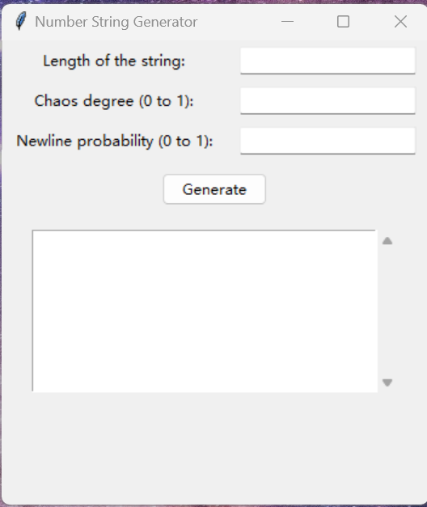

# Number String Generator

## Table of Contents

-   [Overview](#overview)
-   [Features](#features)
-   [Usage](#usage)
-   [Installation](#installation)
-   [Requirements](#requirements)
-   [Contribution](#contribution)
-   [License](#license)
-   [Acknowledgements](#acknowledgements)

## Overview

The Number String Generator is a simple Python application that uses the Tkinter library to create a graphical user interface. It allows users to generate a random string of numbers with a specified degree of "chaos". Users can set the length of the string, the degree of chaos (Chaos Degree), and the probability of newlines to generate a random number string according to specific rules.

## Features

-   **Length Setting**: Users can specify the length of the generated string.
-   **Chaos Degree Setting**: Users can set the probability of numbers changing during generation. The higher the chaos degree, the more frequently the numbers change.
-   **Newline Probability Setting**: Users can set the probability of newlines appearing during string generation.
-   **Display Results**: The generated string is displayed in a scrollable text area for easy viewing.

## Usage

1.  Download and install the required libraries (see Requirements section below).
2.  Run the `Number String Generator.py` file.
3.  Enter the desired parameters in the application interface:
    -   Length of the string
    -   Chaos degree (a decimal between 0 and 1)
    -   Newline probability (a decimal between 0 and 1)
4.  Click the "Generate" button, and the result will be displayed in the text area below.

## Installation

### Prerequisites

Ensure that the following Python library is installed:

-   tkinter

Install the dependency:

`pip install tk` 

## File Structure

-   `Number String Generator.py`: The main program file containing the GUI and string generation logic.
-   `LICENSE.txt`: The MIT license file outlining the terms of use for the software.

## Requirements

`tkinter` 

Ensure that your Python environment has the `tkinter` library installed. You can install it using the following command:

`pip install tk` 

## Contribution

Contributions to this project are welcome. You can contribute by submitting pull requests with your code improvements or by reporting issues and suggestions in the issue tracker.

## License

This project is licensed under the MIT License. For more details, refer to the `LICENSE.txt` file.

## Acknowledgements

-   The [Tkinter](https://docs.python.org/3/library/tkinter.html) library for creating the graphical user interface.
-   The [ttk](https://docs.python.org/3/library/tkinter.ttk.html) module for styling the GUI components.
-   The [random](https://docs.python.org/3/library/random.html) module for generating random numbers and simulating randomness in the number string.
-   The [ScrolledText](https://docs.python.org/3/library/tkinter.scrolledtext.html) widget from Tkinter for displaying the generated output in a scrollable text area.

